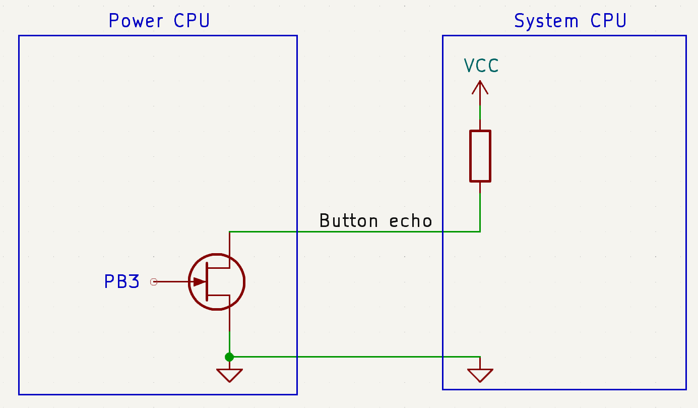
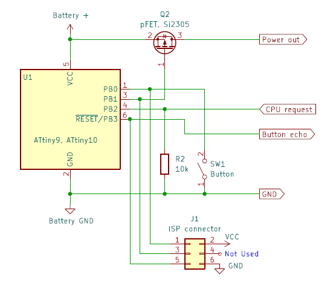

# Soft power switch circuit for battery powered devices

This guide explains how to create a power on/off solution for battery-powered systems, enabling a device to be turned on and off using a simple momentary push button instead of a toggle switch. Additionally, the CPU system itself can control the power, making the solution compact, efficient, and cheap to make.

I frequently design devices such as laser tag guns and lightsabers, which typically include a CPU board with a USB socket, a Li-Ion battery, and a built-in charger. This setup allows the CPU system to be updated via the USB interface, but also serves as the charging connection for the battery. However, using a toggle switch to control the battery introduces several limitations:

- The CPU system cannot turn off the power when the battery is running low.
- The CPU system cannot automatically turn on the battery during charging.
- The toggle switch occupies space and cannot be repurposed by the system CPU.

For years, I searched for a solution to address these issues. While some commercial products include this functionality, I was unable to find a readily available, comprehensive solution. Partial solutions exist for individual problems, but none resolved all the challenges.

In this guide, I will describe the custom solution I developed. It effectively addresses all the issues mentioned above while remaining small, efficient, and inexpensive to implement.

## Features

Before we dive into the solution, let's outline the required features. For clarity, everything that needs to be powered on and off—such as the system CPU, charger, etc.—is referred to as the _system_. The component that controls power on and off is called the _power solution_.  
  

The _power solution_ must provide the following features:  

**Push Button Control**: A push button that can be pressed for a few seconds to turn the power to the system on and off. Power off is also used in case the _system_ CPU is stuck and needs a reset.

**System-Controlled Power**: The _system_ must be able to turn the power on and off programmatically. Power on is used during charging (the _system_ is powered by the USB but needs access to the battery in order to charge it). Power off is used if the battery is running low to protect the battery, but can also be used if the device is idle for a certain among of time.

**Shared Push Button**: The push button's state must be readable by the _system_ for other purposes, such as configuration. This enables the _power solution_ and _system_ to share the same physical button, saving space and components.

**Minimal Standby Power**: In off mode, the _power solution_ must not drain the battery, keeping the standby power for the _power solution_ alone lower than the battery's self-discharge rate.

**Battery Compatibility**: The _power solution_ must operate directly from the battery without any regulator, as regulators will drain the battery. It must support a wide voltage range to accommodate the typical Li-Ion battery range of 2.5V to 4.2V.

**Compact and Cost-Effective Design**: The _power solution_ must have a small footprint, making it easy to integrate into compact designs. Additionally, it must be inexpensive, ensuring its cost is negligible compared to the overall system cost.

## Design

The _power solution_ utilizes a tiny CPU, a pFET, a resistor, and a push button. The power "switch" that transitions battery power to the system is a pFET, which is managed by the _power_ CPU. It is important to select a pFET capable of handling the _system’s_ power requirements. In this example, the SI2305, a SOT23-3 device capable of handling up to 4A, has been chosen, making it suitable for most battery-powered systems.  
  

The push button connects directly to the _power_ CPU, using an internal pull-up resistor. However, the _system_ must also be able to monitor the button's state, which introduces a challenge because the button then must span two different power domains. The _power_ CPU operates in the battery power domain, with logic levels up to 4.2V, while the _system's_ power domain typically operates at 3.3V or lower. Directly connecting the button to a _system_ CPU I/O pin would force the pin to 4.2V, potentially damaging it.

To address this, the button state is echoed on another pin of the _power_ CPU. When the button is pressed, the _power_ CPU outputs LOW; when the button is released, the pin is tri-stated. The _system_ CPU must use an internal pull-up resistor on its input pin, thereby controlling the HIGH logic level. This approach ensures the _power_ _solution_ adapts to the _system_ CPU’s power domain.  
  

Additionally, the _system_ CPU can manage power on and off using the CPU request pin. This pin requires an external pull-down resistor to ensure a defined logic LOW level when the _system_ CPU is powered down.

## State machine

The core functionality of the _power_ CPU firmware is implemented using a state machine.  
  

When the _power_ CPU exits reset, it begins in STATE_OFF. If no activity occurs, the CPU transitions to \`STATE_ON_OFF\` after a 10-second timeout and then to \`STATE_SLEEP\` mode after an additional 3 seconds.

When the button is pressed for more than 1 second, the _power_ CPU wakes up, switches to STATE_OFF, and turns on the _system_ power. It remains in this state until the _system_ CPU sets the CPU request signal to HIGH. This transition is necessary because the _system_ CPU’s ability to set the request signal HIGH is the mechanism for later requesting power off. Once the request signal is HIGH, the _power_ CPU transitions to STATE_ON and remains there until a power-off request is made.

If the button is pressed for more than 4 seconds or the _system_ CPU requests power off, the power CPU turns off the _system_ power and moves to STATE_ON_OFF. In this state, it waits for 3 seconds to ensure the system has powered down fully before entering STATE_SLEEP. The 3-second delay prevents power-down noise on the _system_ CPU request pin from causing unintended behavior.

When the _system_ CPU requests power on for activities like charging, the _power_ CPU wakes up, connects the battery to the _system_, and transitions to STATE_ON.

While in STATE_ON, the _power_ CPU echoes the button state to the _system_ CPU. This allows the _system_ CPU to read the button state and use it for configuration or other purposes.

This state machine design ensures efficient power management and reliable communication between the _power_ and _system_ CPUs.

## Power CPU firmware

This solution is designed with an ATtiny device with the smallest footprint. There exist four nearly identical models: ATtiny4, ATtiny5, ATtiny9, and ATtiny10. All these devices feature 4 I/O pins, 32 bytes of RAM, and differ only in FLASH memory capacity—ATtiny4/5 have 512 bytes, while ATtiny9/10 offer 1024 bytes. They are available in two package options, including the SOT23-6 (3x3mm), which can be hand-soldered. These devices operate within a voltage range of 1.8V to 5.5V, meeting the project’s requirements. For low-quantity purchases, all models are priced similarly so for development, I’ve chosen the ATtiny10 due to its larger FLASH size, though the code is compatible across all four devices.

The code is written in bare-metal C, with no room for unnecessary overhead. This approach requires manually programming all aspects, including CPU initialization, timer configuration, and more. Instead of providing a detailed walkthrough of the code, I’ll highlight key challenges addressed during development.

During initialization, all I/O pins are configured, and the state machine is implemented in function `PollState()`.

A hardware timer (Timer 0) is configured as a counter running at 16 counts per millisecond. A custom delay function uses this counter to measure delays in milliseconds, supporting the state machine’s timing requirements.

When the _system_ is powered off, the CPU enters power-down mode, consuming approximately 100nA as per the datasheet. Achieving this minimal power usage is one of the primary challenges. By default, power-down mode consumes more power due to unnecessary subsystems still running. These are disabled during CPU initialization to meet the ultra-low power requirement.

The power button connects to a CPU pin with an internal pull-up resistor, eliminating the need for an external resistor. The CPU is programmed to wake up from power-down mode on a pin-change event on either the button pin or the CPU request pin. However, this generates an unwanted interrupt, which is handled by a dummy interrupt handler.

Upon waking, the CPU performs a reset to clear any potential memory leaks or errors. This ensures the system always starts in a clean state, preventing long-term failures. The reset is triggered by enabling the watchdog timer, which automatically resets the CPU after a maximum of 16ms.

## ISP programming

The device needs to be programmed before it can be used and in ‘normal’ cases this would be done by using a programmer with a socket that support the device.

However, due to the device's small size, finding a suitable socket can be challenging. It is possible to buy a programmer and then buy a special socket adaptor that fit the selected device, but it gets expensive. Instead, I have chosen to use a programmer, that can program the device on the PCB, called an ISP (In-system programming). I already had an AVRISP MKII, which I am going to use. There exist others (newer) that also will work and, in some cases, have more features. There are however a few challenges when using an ISP approach:

- The ISP needs a 6-pin connector to the PCB in order to program the device, which can be a simple edge connector or a physical pin row. I am using the edge connector for the evaluation board, that is described later.
- The programming voltage needs to be 5V. This will typically require that the _power_ CPU is programmed before the _system_ is connected (soldered), else the _system_ will get 5V on the shared I/O pins which it most likely will not survive. If the board is hand-soldered, this is not a big deal. Just solder the _power_ CPU first, then program it and then solder the rest of the components. It is not expected that the _power_ CPU should ever be updated.

The _power_ CPU has only 4 I/O pins, all of which are used. During programming, the programmer needs to reset the CPU, which conflicts with one of these pins. To resolve this, program the CPU first, and then program the reset fuse to disable the reset functionality of the reset pin. This converts the reset pin into a regular I/O pin. However, disabling the reset pin means the CPU can no longer be reprogrammed. Therefore, test the code thoroughly before setting this fuse. Although some programmers can reverse this fuse, it is often cheaper to replace the CPU and solder a new one.

The code is compiled using Microchip Studio, as it supports the AVRISP MKII programmer. If a newer programmer is used, Microchip offers additional software options. Below is a summary of the programming workflow:

1. Select the actual CPU variant
2. Build everything (compile and link everything together).
3. Attach the programmer to the _power_ CPU and ensure the CPU is powered with 5V, as the programmer does not supply power.
4. Program the file to the CPU’s FLASH memory. Then, test everything is working as expected.
5. Once the code is verified, program the reset fuse (RSTDISBL) to convert the reset pin into an I/O pin (used for button echo functionality). Keep in mind that this step disables further programming of the device.
6. Disconnect the programmer from the _power_ CPU and the _power solution_ is ready for use.

## Evaluation board

Before integrating the _power solution_ into a final product, it must first be developed and thoroughly tested. To achieve this, I needed a platform tailored for development and testing that would allow all features to be evaluated while still permitting CPU updates.

The ATtiny10, described earlier, is unsuitable for this purpose because its button echo feature cannot be tested without permanently disabling further programming. Instead, I opted to use an ATtiny13 for development and testing. The ATtiny13 is similar to the ATtiny10 but offers 6 I/O pins, enabling comprehensive testing of all features without the need to disable programming.

When the test is complete it is however useful that the final implementation also can be tested on the ATtiny10 and specifically test the special fuse programming is working. For that purpose, I build an evaluation board, that support ATtiny4/5/9/10 and ATtiny13 devices and has hardware to test all features. It also has pads to connect a full _system_ to it, for a more realistic test.

  

It has support for the _power_ CPU with two different footprints and two different edge connectors for programming the CPUs. It is only possible to mount one of the CPUs on each board, which can then be programmed using the associated edge connector.

It is possible to mount two pFET (in parallel), just in case more current is needed. One is typically enough.

The board has three special test features:

- A LED (D1) that indicates if the power to the _system_ is on.
- A button and a LED (D2) on the button echo signal, to see that the button echo feature is working.
- A switch to emulate the CPU request signal.

  

I began by writing the code for the ATtiny13 and tested all the features to ensure they worked as intended. The button echo function performed so quickly that any slight delay, caused by reading the button state and then echoing it, was imperceptible.

Next, I measured the power consumption during power-down mode and fine-tuned the CPU parameters to achieve the datasheet-specified power consumption. The final solution with the ATtiny13 consumed approximately 300nA, which is the lowest possible value according to the datasheet.

Afterward, I ported the code to the ATtiny10. During this process, I discovered that many of the configuration registers were incompatible with the ATtiny10, despite most other family variants being compatible. I rewrote the configuration and other special registers to match the ATtiny10's requirements. I then re-optimized the power consumption in power-down mode, achieving approximately 100nA, the lowest possible value as specified in the ATtiny10 datasheet.

## Next steps

The feature requirements outlined at the start have all been met. However, the _power_ CPUs offer additional built-in features like the ADC that could be utilized. While the ATtiny10 is out of spare I/O pins, a spare pin could be freed up if the button echo feature is not required or if the ATtiny13 version is used.

This spare pin could be used to monitoring the battery voltage and cut power to the _system_ if the battery runs low. Implementing this feature would require only two external resistors to divide the voltage, which would then be connected to the spare I/O pin. The CPU uses its ADC to measure the battery voltage and take appropriate action if needed. To avoid unnecessary power consumption during power-down mode, the resistors should be placed after the pFET.

In my designs, I typically integrate voltage monitoring into the _system_ CPU, allowing the battery level to be displayed on an LED or screen. However, this standalone approach may be beneficial for others who require simpler monitoring functionality.

## Conclusion

I have described two implementations of the _power_ _solution_, both of which consume so little power that their usage is negligible compared to the battery's self-discharge rate. Both solutions share the same feature set, are compact, and cost around $1-$2. For completeness I have shown the _power solution_ for the ATtiny4/5/9/10 with the ISP connector, which is needed to program the device.  
  

So far, I have tested the _power solution_ on my evaluation board. I have also integrated it into the next version of my laser tag guns, which will undergo testing soon. This integration enhances user-friendliness by eliminating the risk of forgetting to turn the devices off. Additionally, charging is simplified—users only need to plug in a USB power cable and don’t need the unlogic step of turning on the power switch.

I have also published this article in the Circuit Celler, Issue 417
